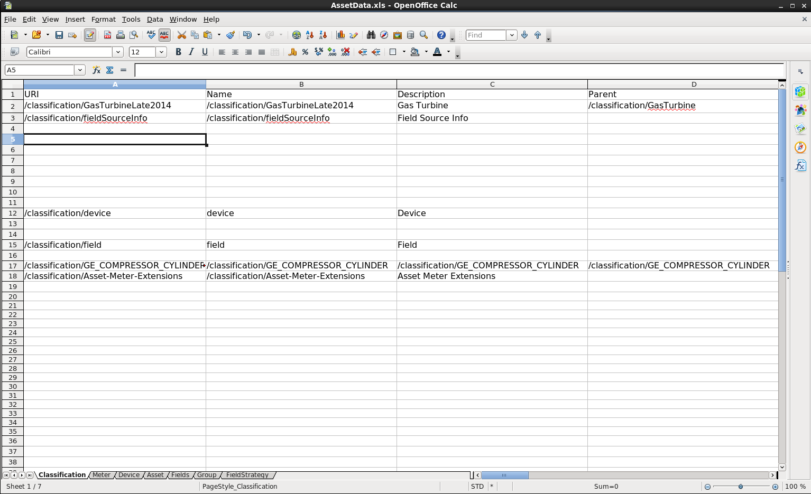

&nbsp;

Welcome to the Data Seed Service.  It's purpose is to seed data from a Spreadsheet and post that data to Predix Asset.  This project runs as either a spring-boot app locally or in the cloud as a microservice too. 

Data Seed currently supports importing data from 4 tabs of the Spreadsheet (other tabs are for future use-cases):
- Classification
- Tag
- Asset
- Group

Simply, edit the data in the Spreadsheet, run the DataSeed as a service and upload the file.

Download the Data-Seed service

      git clone https://github.com/PredixDev/data-seed-service.git

Build it

      mvn clean package

Launch the service locally, e.g.

      java -jar target/data-seed-service-1.0.0.jar
      
Look for the log entry indicating the port used.  e.g. "Tomcat started on port(s): 8184 (http)".  In a browser go to

      http://localhost:8184

Or you can push it to the cloud

      cf push 
      or
      cf push <my-data-seed-service-name>
      
Access at the appropriate cloud url, e.g.

      http://<my-data-seed-service-name>.<my.predix.cloud.url>/
      
Data Seed is gated with Predix Security and Access control as a teaching tool to show you how ACS works.  If you have run the RMD reference app [install script](https://www.predix.io/resources/tutorials/tutorial-details.html?tutorial_id=1473&tag=1610&journey=Connect%20devices%20using%20the%20Reference%20App&resources=1592,1473,1600), it set up UAA, ACS and DataSeed for you.  

Otherwise, you'll need to do the steps located at this link: https://github.com/PredixDev/data-seed-service/tree/master/config/acs

Once you have set up UAA, ACS and have pushed the data-seed to the cloud.  You can go to the URL mentioned above.

In the browser, use the admin credentials to upload the SpreadSheet. (app_admin_1/app_admin_1) 
      
###Import to Eclipse

      mvn eclipse:eclipse
      start eclipse
      File / Import / General / Existing Projects To Workspace 

##Tech Stack
- Spring
- SpringBoot
- SpringTest
- Maven

##Microcomponents
- [AssetBootstrap](https://github.com/predixdev/asset-bootstrap-client)
- [TimeseriesBootstrap](https://github.com/predixdev/timeseries-bootstrap)
- [PredixMicroserviceTemplates](https://github.com/predix/predix-microservice-templates)
- [PredixRestClient](https://github.com/predixdev/predix-rest-client)
  
### More Details
* [More GE resources](http://github.com/predixdev/predix-rmd-ref-app/docs/resources.md)
* [RMD Reference App](http://github.com/predixdev/predix-rmd-ref-app)

